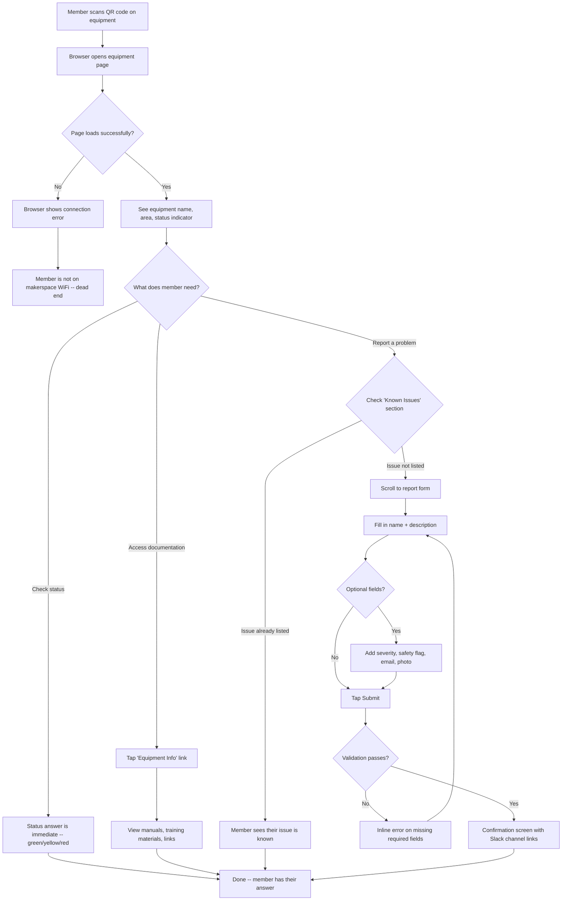
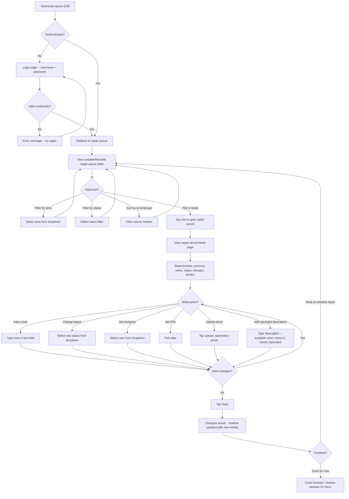
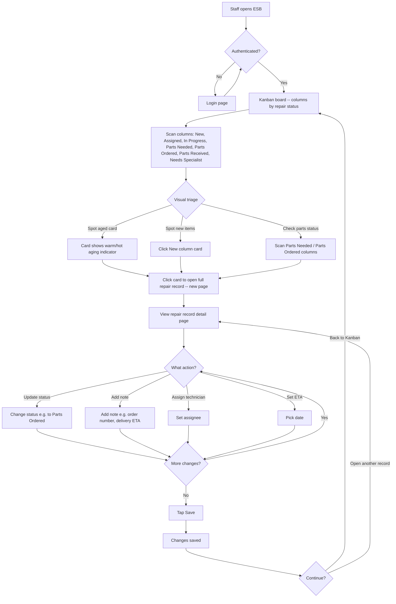
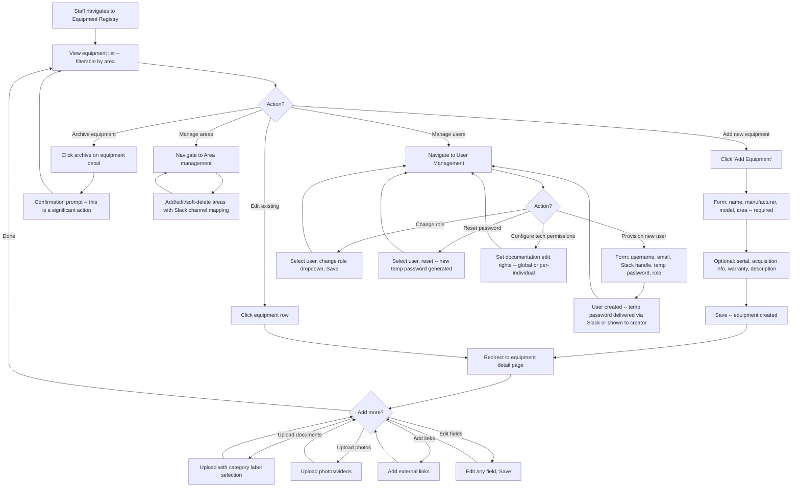

# UX Design Specification: Equipment Status Board

**Author:** Jantman
**Date:** 2026-02-13

---

## Executive Summary

### Project Vision

The Equipment Status Board is a multi-surface application serving a non-profit makerspace community. It bridges the physical and digital worlds -- every piece of equipment becomes a gateway to status, documentation, and problem reporting via QR codes. The UX must serve three distinct user mental models (checking status, managing repairs, coordinating operations) through purpose-built views while maintaining a cohesive experience across web UI, kiosk displays, static pages, and Slack.

### Target Users

- **Members (~600):** Status consumers and problem reporters. Variable tech savvy, often on mobile via QR code scans. Need: instant clarity on "can I use this?" and frictionless reporting when something's wrong. Tolerance for complexity is low -- the value must be obvious in the first interaction.
- **Volunteer Technicians (handful):** Skilled fixers with limited time, working from phones at the bench. Need: a prioritized view of what to work on, with enough context to avoid duplicating effort. UX must support one-handed mobile use while standing in a workshop.
- **Staff/Makerspace Manager (4):** Operational coordinators working primarily from desktop. Need: at-a-glance visibility of all open work, with easy identification of stuck items. UX must surface what needs action without requiring them to dig.

### Key Design Challenges

1. **Three mental models, one system:** Members think "can I use it?", Technicians think "what should I fix?", Staff thinks "what's stuck?" -- each needs a tailored default experience.
2. **Multi-device reality:** Phone-first for Members (QR scans) and Technicians (bench work), desktop for Staff (Kanban management), large-screen for kiosks. Responsive design must be genuinely thoughtful, not just scaled.
3. **Public/authenticated boundary:** Unauthenticated surfaces (QR pages, kiosk, static page) must feel connected to but clearly distinct from authenticated workflows (repair queue, Kanban, admin).
4. **Frictionless reporting vs. duplicate prevention:** QR code pages must show existing issues AND make new reports effortless -- balancing information display with form simplicity.
5. **Slack as a first-class interface:** The Slack experience must feel native to Slack conventions, not a web form transplanted into a chat window.

### Design Opportunities

1. **QR code pages as the signature interaction:** The scan-to-discover moment is the app's primary value proposition for members -- this experience must be polished and immediate.
2. **Visual operational intelligence:** Kanban aging indicators, color-coded status grids, and severity-based prioritization give each user type instant comprehension without reading.
3. **Role-appropriate defaults:** Zero-navigation primary workflows -- each user lands exactly where they need to be.

## Core User Experience

### Defining Experience

The ESB has three distinct core experiences, one per role, but the highest-volume interaction is **status checking** -- Members looking at equipment status before visiting the space. This is the interaction that must be instantaneous, obvious, and trustworthy.

The **signature interaction** is the QR code scan. A member scans a sticker on a machine and immediately sees: is it working, what's wrong if not, where the manuals are, and a way to report a new problem. This is the moment the app earns its place in the makerspace. Every design decision for the public-facing pages should be evaluated against: "does this make the QR scan experience better or worse?"

For Technicians, the core experience is **queue-driven repair work** -- land on the repair queue, pick something, update it from your phone, move on. For Staff, it's **operational awareness** -- open the Kanban, see what's stuck, take action.

### Platform Strategy

- **Web application** -- no native mobile apps. Responsive design across phone, desktop, and large-screen kiosk.
- **Mobile-first for public surfaces:** QR code pages, problem reporting, and status checking are designed for phone screens first. Members and Technicians are standing in a workshop with a phone, not sitting at a desk.
- **Desktop-optimized for management:** Kanban board, equipment registry, and user admin are designed for desktop use. These are Staff workflows performed from a workstation.
- **Large-screen kiosk mode:** Stripped-down, high-contrast display optimized for visibility across a room. Auto-refresh, no interaction required.
- **No offline requirement:** The app runs on the local network inside the space. Internet is needed only for Slack integration and static page push.

### Effortless Interactions

- **Checking status must be zero-friction.** No login, no navigation, no learning curve. The static page, kiosk display, and QR code pages are all unauthenticated. A member should go from "I wonder if the SawStop is working" to "yes it is" in under 5 seconds.
- **Problem reporting must be under 90 seconds.** Scan QR code, see the form, fill in name + description, submit. Two required fields. Everything else is optional. Existing issues are shown above the form so the member can stop early if their problem is already known.
- **Technician record updates from the bench.** One-handed phone use. The repair record must be updatable (status change, add a note) without pinch-zooming, horizontal scrolling, or navigating away from the record.
- **Staff operational triage at a glance.** The Kanban board must communicate priorities visually -- aging indicators, severity colors, status columns -- without requiring Staff to click into individual records to understand the state of things.

### Critical Success Moments

1. **Member: "I checked before I drove."** The first time a member looks at the status page, sees a yellow or red indicator, and adjusts their plans accordingly. This is when the app proves it saves real time and frustration.
2. **Member: "I reported it and it got fixed."** A member scans a QR code, reports a problem in 90 seconds, and later sees the machine is green again. The feedback loop builds trust and encourages future reporting.
3. **Technician: "I didn't waste my time."** A Technician reads the previous person's diagnostic notes and picks up where they left off instead of repeating work. The repair queue becomes the reason volunteer time feels well-spent.
4. **Staff: "I can see what's stuck."** The Makerspace Manager opens the Kanban on Monday morning and immediately spots the items that need her action -- no Slack archaeology required.

### Experience Principles

1. **Status at a glance, details on demand.** Every view leads with the answer to "what do I need to know right now?" -- color-coded status, severity, age. Details are one click deeper, never cluttering the primary view.
2. **The QR code is the front door.** For most members, the QR scan is their first and most frequent interaction with the app. This page must be fast, clear, and self-explanatory with no onboarding needed.
3. **Each role gets their own home.** No universal dashboard that tries to serve everyone. Members land on status. Technicians land on the repair queue. Staff lands on the Kanban. Navigation exists, but the default view is purpose-built.
4. **Don't make volunteers think.** Technicians and Staff are donating their time. Every unnecessary tap, confusing label, or ambiguous workflow costs goodwill. The interface must respect their time by being obvious.
5. **Trust is earned by accuracy.** The entire system's value depends on members trusting that the displayed status is current. UX must reinforce this -- show timestamps, show recent activity, never display stale data without indication.

## Desired Emotional Response

### Primary Emotional Goals

- **Members: Confidence and Trust.** "I can rely on this information." The ESB must feel like a dependable utility -- not exciting, but always right. The emotion that drives adoption is relief: "I checked before I drove and it saved me a wasted trip."
- **Technicians: Efficiency and Agency.** "I'm making good use of my time." Volunteer hours are precious. The system should make Technicians feel productive and valued -- their notes matter, their work is visible, nothing is wasted.
- **Staff: Control and Clarity.** "I can see everything I need to act on." The Kanban board replaces the anxiety of "what am I forgetting?" with the calm of "here's what needs my attention."

### Emotional Journey Mapping

| Stage | Member | Technician | Staff |
|-------|--------|------------|-------|
| **Discovery** | Curiosity ("what does this QR code do?") | Orientation ("let me see what's here") | Ownership ("let me set this up") |
| **First use** | Relief ("this is simple and clear") | Satisfaction ("I can see what needs fixing") | Confidence ("I can see everything at once") |
| **Core action** | Assurance ("I trust this status") | Agency ("I'm picking the right thing to work on") | Clarity ("I know what's stuck") |
| **After completing task** | Gratitude ("that was easy") | Accomplishment ("I left good notes for the next person") | Progress ("things are moving") |
| **When something goes wrong** | Reassurance ("my report landed, someone will see it") | Patience ("I logged what I found, it'll get resolved") | Awareness ("I can see the blocker and act on it") |
| **Returning** | Habit ("let me check before I go") | Purpose ("let me see what's new in the queue") | Routine ("Monday morning Kanban check") |

### Micro-Emotions

**Critical:**
- **Confidence over Confusion.** Status must be unambiguous. Green means working. Red means down. Yellow means degraded. No "what does this mean?" moments.
- **Trust over Skepticism.** Timestamps, recent activity indicators, and "last updated" cues reinforce that information is current. Stale-looking data destroys the system's value.

**Important:**
- **Accomplishment over Frustration.** Technicians must feel their time was well-spent. Previous diagnostic notes, clear next steps, and visible repair history reinforce this.
- **Ease over Burden.** Problem reporting must feel like a quick good deed, not a chore. Two required fields, big submit button, instant confirmation.

**Supporting:**
- **Belonging over Isolation.** The system subtly reinforces community: someone reported this, someone's working on it, the repair got done. Members see that the makerspace takes care of its equipment and each other.

### Design Implications

- **Trust → Show freshness everywhere.** Every status display should indicate when it was last updated. The kiosk shows its refresh cycle. Repair records show timestamps on every note. Members should never wonder "is this information current?"
- **Confidence → Eliminate ambiguity.** Color coding is consistent across every surface (green/yellow/red). Status labels are plain language. Severity is immediately visible without clicking into details.
- **Efficiency → Minimize steps for Technicians.** Status changes and note additions should be achievable in 2-3 taps from the repair record. No modal confirmation dialogs for routine updates. Save and continue, don't save and navigate away.
- **Ease → Progressive disclosure on QR pages.** Lead with status (the answer to "is it working?"), then existing issues (the answer to "is my problem already known?"), then the report form (the action if it's new). Don't front-load the form.
- **Belonging → Close the loop visually.** When a member returns to a QR page and sees their reported issue now has a repair record with notes and a resolution, the system demonstrates that reporting matters.

### Emotional Design Principles

1. **Dependable over delightful.** This is a utility, not an entertainment product. Consistency, accuracy, and reliability create the emotional foundation. No animations, gamification, or engagement tricks -- just trustworthy information.
2. **Calm over urgent.** Even when equipment is down, the tone is informational, not alarming. Red means "not working," not "emergency." The system informs decisions; it doesn't create panic.
3. **Respectful of volunteer time.** Every interaction should feel like the system is working for the user, not the other way around. No unnecessary confirmations, no forced workflows, no hoops.
4. **Quietly communal.** The system doesn't explicitly celebrate community, but the flow of reports, repairs, and resolutions implicitly demonstrates that people care and the organization works.

## UX Pattern Analysis

### Applicable UX Patterns

**Status Grid Pattern (Kiosk & Status Dashboard)**
- Color-coded grid organized by area, readable from across a room (kiosk) or at a glance on a phone (status page)
- Three-state system: green (operational), yellow (degraded), red (down) -- no ambiguity, no in-between
- Each cell shows equipment name, status color, and brief description of issue if not green
- Pattern rationale: the answer to "can I use this?" must be visual and instant, not textual

**Progressive Disclosure Pattern (QR Code Equipment Pages)**
- Layer 1: Equipment status (the immediate answer)
- Layer 2: Existing open issues (duplicate prevention -- "is my problem already known?")
- Layer 3: Report form (action -- only if needed)
- Layer 4: Documentation links (reference -- manuals, training materials)
- Pattern rationale: most visitors just want to check status or see if their issue is known. The report form is important but secondary. Don't lead with the form.

**Work Queue Pattern (Technician Repair Queue)**
- Sortable/filterable table with key columns: equipment name, severity, area, age, status, assignee
- Default sort by severity (Down first) then age (oldest first)
- Row-level visual severity indicators (color-coded left border or icon)
- Click-through to full repair record
- Pattern rationale: Technicians need to quickly scan, filter to their area of expertise, and pick the highest-impact item

**Kanban Board Pattern (Staff Overview)**
- Columns by repair status (New, Assigned, In Progress, Parts Needed, Parts Ordered, Parts Received, Needs Specialist)
- Cards show equipment name, area, severity color, and time-in-column
- Visual aging: cards that have been in a column too long get a visual indicator (e.g., subtle background tint or border)
- Read-only -- Staff clicks through to the repair record to take action
- Pattern rationale: the Kanban answers "what's stuck?" without reading. Column position + aging indicator = instant triage

**Append-Only Timeline Pattern (Repair Record Detail)**
- Chronological log of notes, status changes, and uploads with author + timestamp
- New entries added at the bottom (or top, with newest-first option)
- Status changes shown inline as timeline events, not just in a header field
- Pattern rationale: repair records are collaborative documents built over time by multiple people. The timeline tells the story of a repair from report to resolution.

**Minimal Form Pattern (Problem Reporting)**
- Two required fields: name, description
- Smart defaults: severity defaults to "Not Sure," no fields pre-expanded
- Optional fields clearly secondary (collapsible or visually de-emphasized): safety risk flag, consumable checkbox, email, photo upload
- Large, obvious submit button
- Pattern rationale: every additional required field reduces reporting rates. The goal is "good enough to act on," not "complete documentation"

### Anti-Patterns to Avoid

- **Dashboard-itis:** Don't create a single "dashboard" view that tries to serve all roles. Each role has fundamentally different questions; forcing a universal view makes it mediocre for everyone.
- **Form-first QR pages:** Don't lead with the report form when a member scans a QR code. Most scans are for information (status, manuals), not reporting. The form should be below the fold.
- **Enterprise workflow rigidity:** Don't enforce strict status transitions. Technicians should be able to move a repair record from "New" directly to "Parts Needed" if that's what the diagnosis reveals. The workflow is descriptive, not prescriptive.
- **Notification overload:** Don't notify on every field change. Configurable triggers with sensible defaults (new report, resolved, severity change, ETA update) prevent notification fatigue.
- **Modal confirmation dialogs for routine actions:** Don't ask "Are you sure?" for status changes or note additions. These are routine, reversible actions. Confirmation dialogs slow down Technicians working from phones at the bench.
- **Desktop-assumed responsive design:** Don't design for desktop and then squeeze it onto mobile. The QR code pages and repair record updates are phone-first interactions -- design them for a 375px viewport first, then expand for desktop.

### Design Inspiration Strategy

**Adopt:**
- Color-coded status grids as the primary communication mechanism across all public surfaces
- Progressive disclosure on equipment pages (status → issues → form → docs)
- Append-only timelines for repair records to preserve institutional knowledge
- Role-based default landing pages with zero navigation required for primary task

**Adapt:**
- Kanban boards -- use the column metaphor but keep it read-only for Staff (edits happen in the repair record, not by dragging cards)
- Work queue tables -- standard sortable table but with mobile-optimized touch targets and no horizontal scroll on phone

**Avoid:**
- Universal dashboards that serve no one well
- Form-heavy workflows that discourage participation
- Strict workflow enforcement that doesn't match how volunteers actually work
- Desktop-first responsive design that treats mobile as an afterthought

## Design System Foundation

### Design System Choice

**Bootstrap 5** -- used as the primary design system and component library for the Equipment Status Board.

### Rationale for Selection

- **Volunteer-maintainable:** Bootstrap is the most widely known CSS framework. Future contributors are likely to already have experience with it, reducing onboarding friction.
- **Server-rendered compatibility:** Bootstrap works natively with server-rendered HTML (no JavaScript framework dependency). Pairs naturally with a Python multi-page application.
- **Comprehensive component library:** Provides tables, cards, forms, badges, grids, modals, navbars, and color utilities out of the box -- covering the ESB's core UI needs (status grids, repair queue tables, Kanban cards, report forms, kiosk layouts).
- **Responsive by default:** Built-in responsive grid and breakpoints handle the ESB's multi-device reality (phone, desktop, kiosk) without custom media query work.
- **Accessibility built-in:** ARIA attributes, keyboard navigation, focus management, and screen reader support are included in Bootstrap components by default.
- **Dependable over delightful:** Aligns with the emotional design principle -- Bootstrap is not flashy, but it's reliable, well-documented, and unsurprising. The right tone for an operational utility tool.

### Implementation Approach

- Use Bootstrap 5 via CDN or npm package (decision deferred to architecture phase)
- Server-rendered HTML with Bootstrap classes -- no React, Vue, or other JS framework required
- Bootstrap's JavaScript components (modals, dropdowns, tooltips) used where needed via the vanilla JS API
- Minimal custom JavaScript for specific interactions (e.g., kiosk auto-refresh, form validation)

### Customization Strategy

**Branding:**
- Incorporate the Decatur Makers logo in the navbar/header
- Override Bootstrap's default primary color palette with Decatur Makers brand colors via CSS custom properties (`--bs-primary`, `--bs-secondary`, etc.)
- Keep branding minimal and functional -- logo + color scheme, not a full visual identity overhaul

**Status Colors (Do Not Override):**
- Green, yellow, and red for equipment status are functional, not brand colors. These must remain standard, high-contrast, and universally understood. They should not be customized to match branding.

**Component Customization:**
- Use Bootstrap's utility classes and standard components wherever possible -- minimize custom CSS
- Custom styling limited to: status color indicators, Kanban card aging visuals, kiosk display layout, and QR code page mobile optimization
- All custom CSS organized in a single project stylesheet that layers on top of Bootstrap, not interleaved with it

## Defining Interaction

### The Defining Experience

**"Scan the code, see the status, report if needed."**

The QR code scan is the interaction that defines the Equipment Status Board. It's the physical-digital bridge that turns a sticker on a machine into a gateway for status, documentation, and problem reporting. If this interaction is fast, clear, and useful, the app earns its place in the makerspace. If it's slow, confusing, or cluttered, nothing else matters.

Every other surface -- the kiosk, the static page, the Slack bot, the repair queue, the Kanban -- supports this interaction or builds on the data it generates.

### User Mental Model

**How members currently solve this problem:**
- Look at the machine and guess
- Check for a handwritten sign
- Ask someone nearby
- Search Slack (maybe)
- Give up and try using it anyway

**The mental model members bring to a QR scan:**
- "I scan this, I get information about this specific machine"
- Expectation: instant, specific, no login required
- Analogy: scanning a QR code at a restaurant to see the menu -- fast, obvious, no friction

**Where confusion could occur:**
- If the page is slow to load or shows a generic landing page instead of machine-specific info
- If the status indicator is ambiguous (what does yellow mean exactly?)
- If the report form is above the status (members might think reporting is the primary purpose)
- If there's too much information and the status answer is buried

### Success Criteria

- **Speed:** QR page loads and displays status in under 2 seconds on the local network
- **Clarity:** A member can determine the machine's status without reading any text -- the color indicator is the answer
- **Self-explanatory:** No onboarding, instructions, or prior knowledge needed. First-time scan to comprehension in under 5 seconds
- **Useful beyond status:** The page also serves as a gateway to machine documentation (manuals, training materials) and problem reporting
- **Report completion:** A member who decides to report a problem can complete the form and submit in under 90 seconds
- **Duplicate awareness:** A member with a known issue sees it listed and knows they don't need to re-report

### Novel UX Patterns

The ESB uses **entirely established patterns** -- no novel interaction design is needed. The innovation is in the **combination and context**, not the patterns themselves:

- Status indicators: established (traffic light colors)
- QR code to web page: established (restaurant menus, product info)
- Problem report form: established (contact/feedback forms)
- Progressive disclosure: established (summary → detail)

The unique value is applying these familiar patterns to a physical makerspace context where no digital solution currently exists. Members don't need to learn anything new -- they scan a code and see a web page. The pattern is instantly understood.

### Experience Mechanics

**The QR Code Scan Flow:**

**1. Initiation**
- Member sees QR code sticker physically attached to a piece of equipment
- Scans with phone camera (no app required -- native camera QR recognition)
- Browser opens the equipment-specific page on the local network

**2. Page Structure (Progressive Disclosure)**

*Immediate view (above the fold on mobile):*
- Equipment name and area (e.g., "SawStop #1 -- Woodshop")
- Large, prominent status indicator (green/yellow/red) with text label ("Operational" / "Degraded" / "Down")
- If yellow or red: brief description of the current issue and ETA if available
- Link to detailed equipment information (manuals, training materials, documentation)

*Below the fold:*
- Open issues section (if any exist): list of current open repair records with severity and description, framed as "Known Issues" with messaging like "If your issue is listed below, it's already being worked on"
- Problem report form: name (required), description (required), severity (defaults to "Not Sure"), safety risk flag, consumable checkbox, email (optional), photo upload (optional)
- Large, obvious submit button

**3. Feedback**
- Status color is the primary feedback -- instantly communicates machine state
- If issues exist, the "Known Issues" list confirms the system is aware and working on it
- Form submission shows a confirmation message with links to the relevant Slack channels (#area-channel and #oops)
- If form validation fails (missing required fields), inline error messages appear next to the fields

**4. Completion**
- For status checking: the interaction is complete the moment the page loads. The member has their answer.
- For problem reporting: the interaction is complete at the confirmation screen. The member knows their report landed and where it was posted.
- No further action required. No account creation, no follow-up steps, no "check back later" -- the system handles it from here.

## Visual Design Foundation

### Color System

**Approach:** Start with Bootstrap 5's default color palette and provide a documented customization path for Decatur Makers branding.

**Functional Status Colors (Fixed -- Do Not Theme):**
- **Green (`#198754` / Bootstrap `success`):** Equipment operational
- **Yellow (`#ffc107` / Bootstrap `warning`):** Equipment degraded (includes "Not Sure" severity)
- **Red (`#dc3545` / Bootstrap `danger`):** Equipment down
- These colors are functional, not decorative. They must remain consistent across all surfaces (kiosk, QR pages, static page, Slack notifications) and must not be overridden by branding.

**UI Colors (Themeable):**
- **Primary:** Bootstrap default (`#0d6efd`) -- used for links, primary buttons, active states
- **Secondary:** Bootstrap default (`#6c757d`) -- used for secondary actions, muted text
- **Background:** White (`#ffffff`) with light gray (`#f8f9fa`) for alternating sections
- **Text:** Near-black (`#212529`) for body text, gray (`#6c757d`) for secondary text

**Branding Customization Path:**
- All themeable colors defined via Bootstrap CSS custom properties (`--bs-primary`, `--bs-secondary`, etc.)
- A single `_variables.scss` or `:root` CSS block overrides Bootstrap defaults with organization colors
- Logo placement: navbar/header, sized to fit Bootstrap's default navbar height
- Documented in a "Branding Customization" section of the project README so volunteers can update colors without deep CSS knowledge

**Kanban Aging Indicators:**
- Cards in a column for 0-2 days: no additional styling
- Cards in a column for 3-5 days: subtle warm background tint
- Cards in a column for 6+ days: stronger visual indicator (e.g., left border accent or background highlight)
- Exact thresholds configurable; visual treatment uses Bootstrap utility classes where possible

### Typography System

**Font Stack:** Bootstrap 5 default system font stack:
```
system-ui, -apple-system, "Segoe UI", Roboto, "Helvetica Neue", "Noto Sans", "Liberation Sans", Arial, sans-serif
```

**Rationale:**
- Zero font loading delay -- renders immediately using the user's native OS font
- Familiar and readable across all devices and operating systems
- No external font dependencies (aligns with on-premises, no-internet-required deployment)

**Type Scale:** Bootstrap 5 defaults:
- `h1`: 2.5rem -- page titles (equipment name on detail pages, "Equipment Status Board" on dashboard)
- `h2`: 2rem -- section headers (area names on kiosk, Kanban column headers)
- `h3`: 1.75rem -- subsection headers
- `h4`: 1.5rem -- card titles (equipment names in lists/grids)
- Body: 1rem (16px) -- standard text, form labels, table content
- Small: 0.875rem -- timestamps, secondary metadata, help text

**Status Indicator Text:**
- Status labels ("Operational," "Degraded," "Down") use bold weight at body size
- On kiosk displays, status text and equipment names scale up for room-distance readability

### Spacing & Layout Foundation

**Approach:** Use Bootstrap 5's default spacing scale and responsive grid. Customize per-view only where the default doesn't serve the specific context.

**Spacing Scale:** Bootstrap default (based on 1rem = 16px):
- `0`: 0
- `1`: 0.25rem (4px)
- `2`: 0.5rem (8px)
- `3`: 1rem (16px)
- `4`: 1.5rem (24px)
- `5`: 3rem (48px)

**Layout by View:**
- **QR code pages (mobile-first):** Single-column layout, generous touch targets (minimum 44x44px tap areas), Bootstrap's default container with responsive padding
- **Kiosk display:** Full-width grid of equipment cards by area, no container max-width constraint, larger font sizes for distance readability
- **Repair queue (responsive):** Bootstrap responsive table on desktop, stacked card layout on mobile (table rows become cards at small breakpoints)
- **Kanban board (desktop-optimized):** Horizontal scrolling columns, each column a fixed width. On mobile, columns stack vertically or a horizontal swipe pattern is used
- **Equipment registry / admin (desktop):** Standard Bootstrap container with forms and tables

**Grid System:** Bootstrap 12-column responsive grid with standard breakpoints:
- `xs`: <576px (phones -- QR pages, repair record updates)
- `sm`: >=576px
- `md`: >=768px (tablets)
- `lg`: >=992px (desktops -- Kanban, registry)
- `xl`: >=1200px
- `xxl`: >=1400px (kiosk displays)

### Accessibility Considerations

- **Color contrast:** Bootstrap's default palette meets WCAG AA contrast ratios. Status colors (green/yellow/red) are supplemented with text labels and icons -- never rely solely on color to convey status.
- **Touch targets:** Minimum 44x44px for all interactive elements on mobile views (per WCAG 2.5.5)
- **Focus indicators:** Bootstrap's default focus rings preserved -- no custom styling that removes or diminishes focus visibility
- **Semantic HTML:** Proper heading hierarchy, form labels, alt text for images, ARIA attributes on interactive components
- **Keyboard navigation:** All authenticated workflows navigable via keyboard (tab, enter, escape, arrow keys where appropriate)
- **Motion:** No animations or transitions beyond Bootstrap's minimal defaults. No auto-playing media. Kiosk refresh is a page-level reload, not an animated transition.

## Design Direction

### Approach

Design direction mockups were deferred. The visual direction for the Equipment Status Board is fully defined by the preceding decisions: Bootstrap 5 defaults, functional status colors, system fonts, and responsive layouts tailored per view. No visual differentiation exercise is needed -- the product's value is in utility, not visual identity. Layout specifics for each view are defined in the UX Pattern Analysis and will be further detailed in the user journey flows.

## User Journey Flows

### Journey 1: Member Checks Status & Reports a Problem

**Entry points:** QR code scan, status page bookmark, Slack bot query, kiosk display

**Primary flow (QR code scan):**



**Key UX decisions:**
- Status is visible immediately on page load -- no scrolling, no tapping
- Known Issues shown before the report form to prevent duplicates
- Report form has only 2 required fields (name, description)
- Confirmation closes the loop with Slack channel links
- No login required for any part of this flow

### Journey 2: Technician Works the Repair Queue

**Entry point:** Login → lands on repair queue (default Technician view)



**Key UX decisions:**
- Repair queue is the default landing page for Technicians -- zero navigation to primary task
- Multiple changes (status + note + assignee) can be made before a single explicit Save
- Timeline shows all previous notes and status changes with author + timestamp
- No confirmation dialogs for saves -- the action is routine and the audit trail provides undo visibility
- Status dropdown allows any-to-any transitions (no enforced sequence)
- Mobile-optimized: form fields are full-width, touch targets are large, no horizontal scrolling

### Journey 3: Staff Manages Operations via Kanban

**Entry point:** Login → lands on Kanban board (default Staff view)



**Key UX decisions:**
- Kanban is read-only -- no drag-and-drop. All edits happen on the repair record detail page.
- Cards show: equipment name, area, severity color, time-in-column
- Aging indicators provide instant visual triage without clicking into records
- Clicking a card navigates to the repair record (new page, not modal)
- Browser back button returns to Kanban (standard navigation, no SPA complexity)

### Journey 4: Staff Manages Equipment & Users

**Entry points:** Navigation menu → Equipment Registry / User Management



**Key UX decisions:**
- Equipment creation has only 4 required fields (name, manufacturer, model, area) -- get it into the system fast, add details later
- Documents, photos, and links are added after initial creation on the detail page
- Archive requires confirmation (significant, harder to reverse)
- User provisioning delivers temp password via Slack message (preferred) or visible to creator (fallback)
- Area management includes Slack channel mapping as a required field

### Journey Patterns

**Common patterns across all journeys:**

**Navigation:**
- Role-based default landing page (no "home" page -- each role lands on their primary view)
- Top navbar with role-appropriate links (Members see: Status Dashboard, Equipment Info; Technicians add: Repair Queue; Staff add: Kanban, Equipment Registry, Users)
- Standard browser back/forward navigation -- no SPA routing complexity

**Data Entry:**
- Explicit Save action for all form submissions (no auto-save)
- Multiple changes allowed before saving
- Inline validation on required fields
- No confirmation dialogs for routine saves (status changes, notes)
- Confirmation required only for significant/destructive actions (archive equipment)

**Feedback:**
- Success: page updates to reflect saved changes, success toast/banner briefly shown
- Error: inline field-level errors for validation failures, page-level error banner for server errors
- No loading spinners for standard page loads (server-rendered, should be fast on LAN)

**Mobile Adaptation:**
- Tables become stacked cards on small screens
- Form fields go full-width
- Touch targets minimum 44x44px
- No horizontal scrolling on any mobile view

### Flow Optimization Principles

1. **Minimize steps to value.** Status check: 1 step (page load). Problem report: 3 steps (scan, fill 2 fields, submit). Repair update: 3 steps (find record, make changes, save).
2. **Batch before saving.** Allow multiple changes to a repair record before requiring a save action. Don't force save-per-field.
3. **Progressive disclosure everywhere.** Show the essential information first, details on demand. QR pages: status → issues → form. Repair queue: table → record detail → timeline.
4. **Error recovery is gentle.** Validation errors are inline and specific. Server errors show a clear message. No data loss on error -- form state is preserved.
5. **Back button always works.** Server-rendered pages with standard navigation. No broken back button, no "are you sure you want to leave" dialogs except on unsaved form changes.

## Component Strategy

### Bootstrap 5 Components Used

**Direct from Bootstrap (no customization needed):**
- **Tables:** Repair queue (sortable, filterable), equipment registry list, user management list
- **Cards:** Kanban cards, kiosk equipment cards, mobile stacked row replacements
- **Forms:** Problem report form, equipment creation/edit, user provisioning, login, repair record editing
- **Badges:** Severity labels, status labels, role indicators
- **Navbar:** Top navigation with role-appropriate links and logo
- **Alerts / Toasts:** Success/error feedback after save actions
- **Modals:** Archive confirmation, other destructive action confirmations
- **Dropdowns:** Area filter, status filter, status change, assignee selection
- **Buttons:** Primary (submit/save), secondary (cancel/back), danger (archive/delete)
- **List Groups:** Document lists on equipment detail pages, link lists
- **Breadcrumbs:** Navigation context on detail pages (e.g., Woodshop → SawStop #1 → Repair #42)
- **Pagination:** Equipment registry list, user management list (if needed)

**Bootstrap with minor styling customization:**
- **Progress bars or badges for ETA display** -- standard component with status-color theming
- **File upload inputs** -- standard form input with photo preview

### Custom Components

#### Status Indicator

**Purpose:** Universal visual communication of equipment operational state. Used on every surface that shows equipment status.

**Anatomy:**
- Color fill or background (green/yellow/red)
- Icon (checkmark / warning triangle / X-circle) for non-color-dependent recognition
- Text label ("Operational" / "Degraded" / "Down")

**Variants:**
- **Large:** QR code equipment page hero display -- prominent, above-the-fold, immediately readable. Color background block with icon and text.
- **Compact:** Table cells (repair queue), Kanban cards, kiosk grid cells -- badge-sized, color + icon + short text.
- **Minimal:** Static status page -- color dot + equipment name, no text label (status communicated by color and position in area group).

**States:**
- Green / Operational: no open repair records, or all closed
- Yellow / Degraded: open repair record with severity "Degraded" or "Not Sure"
- Red / Down: open repair record with severity "Down"

**Accessibility:**
- Never rely on color alone -- always pair with icon and/or text label
- ARIA label: "Equipment status: [Operational/Degraded/Down]"
- Sufficient contrast ratio on all color variants (Bootstrap success/warning/danger meet WCAG AA)

#### Kanban Board

**Purpose:** Staff operational overview of all open repair records organized by workflow status.

**Anatomy:**
- Horizontal row of columns, one per active repair status
- Column header: status name + count of cards in column
- Cards within each column, ordered by time-in-column (oldest at top)
- Each card: equipment name, area badge, severity indicator (compact), time-in-column text

**Layout:**
- Desktop: horizontal scrolling container with fixed-width columns (~250px each)
- Mobile: vertical stack of collapsible sections (one per status), or horizontal swipe
- Columns shown: New, Assigned, In Progress, Parts Needed, Parts Ordered, Parts Received, Needs Specialist (7 columns -- Resolved and Closed statuses excluded from Kanban)

**Aging Indicators:**
- 0-2 days in column: default card styling
- 3-5 days: subtle warm tint (e.g., light amber background or left border)
- 6+ days: stronger indicator (e.g., darker amber/orange left border or background)
- Aging thresholds should be configurable

**Interaction:**
- Read-only board -- no drag-and-drop
- Click card → navigate to repair record detail page (new page)
- No inline editing on the Kanban

**Accessibility:**
- Each column is a labeled region (ARIA landmark)
- Cards are focusable and activatable via keyboard (Enter to navigate)
- Aging status communicated via ARIA label, not just color

**Implementation:** Built from Bootstrap cards inside a custom flexbox/overflow-x container. No third-party Kanban library needed.

#### Repair Timeline

**Purpose:** Chronological record of all activity on a repair record -- notes, status changes, uploads, assignee changes.

**Anatomy:**
- Vertical timeline, newest entry at top (most recent activity is what matters)
- Each entry: timestamp, author name, entry type icon, content
- Entry types:
  - **Note:** text content, potentially with attached photos
  - **Status change:** "Status changed from [X] to [Y]" with status badges
  - **Assignee change:** "Assigned to [name]" or "Unassigned"
  - **ETA update:** "ETA set to [date]" or "ETA removed"
  - **Photo/video upload:** thumbnail with link to full size
  - **Creation:** "Repair record created" with original report details

**Interaction:**
- Read-only display of existing entries
- "Add note" text area and "Save" button at the top (above the timeline)
- Photos expand to full size on click/tap

**Mobile:**
- Full-width, single-column timeline
- Photos shown as thumbnails to conserve vertical space
- Timestamps use relative format on mobile ("2 hours ago") and absolute on desktop ("Feb 13, 2026 2:34 PM")

**Accessibility:**
- Timeline is an ordered list (`<ol>`) for screen readers
- Each entry has a clear label combining author, action type, and timestamp
- Photos have alt text describing the content if provided, or "Diagnostic photo" as fallback

**Implementation:** Built from Bootstrap list groups or a custom `<ol>` with Bootstrap utility classes. No third-party timeline library needed.

#### Kiosk Display Grid

**Purpose:** Large-screen, room-readable display of all equipment status organized by area. Designed for wall-mounted monitors or projectors.

**Anatomy:**
- Area sections, each with a heading and a grid of equipment cards
- Each card: equipment name + status indicator (compact variant)
- If degraded or down: brief issue description below equipment name
- Auto-refresh every 60 seconds (full page reload)
- Kiosk mode activated via URL parameter (e.g., `?kiosk=true`)

**Layout:**
- Full viewport width, no navbar, no footer, no navigation controls
- Area headings as section dividers
- Equipment cards in a responsive grid (auto-fill, adapts to screen width)
- Large font sizes for distance readability (equipment names ~1.5-2rem, area headings ~2.5rem)

**States:**
- Normal: green cards dominate, occasional yellow/red
- Heavy outage: many red/yellow cards -- layout still readable, no overflow issues

**Accessibility:**
- Semantic headings for areas
- Status indicator includes text label (not just color)
- High contrast mode compatible (Bootstrap default colors meet this)

**Implementation:** Custom page template using Bootstrap grid with enlarged typography. URL parameter triggers kiosk-specific template (no nav, no container max-width, scaled fonts). Auto-refresh via `<meta http-equiv="refresh" content="60">`.

#### QR Code Equipment Page Template

**Purpose:** Mobile-first page template for the defining interaction -- scan QR code, see status, report if needed.

**Anatomy (top to bottom):**
1. Equipment name + area (h1-level)
2. Status indicator (large variant) -- the immediate answer
3. If degraded/down: current issue summary + ETA if available
4. "Equipment Info" link → documentation page (manuals, training, links)
5. "Known Issues" section (if open repair records exist): list of open issues with severity + description
6. "Report a Problem" form: name, description (required); severity, safety flag, consumable, email, photo (optional)
7. Submit button (large, full-width, prominent)

**Post-submission:**
- Form replaced with confirmation message
- Slack channel links displayed (#area-channel, #oops)
- "Report another issue" link to reset the form

**Mobile optimization:**
- Single-column, no horizontal scroll
- Form fields full-width
- Submit button full-width, minimum 48px height
- Photo upload triggers native camera/gallery picker

**Implementation:** Custom page template using Bootstrap container, cards, forms, and utility classes. No custom JavaScript beyond basic form validation.

### Component Implementation Strategy

**Principle:** Use Bootstrap components directly wherever possible. Build custom components from Bootstrap primitives (cards, utilities, grid). No third-party UI component libraries.

**Custom CSS budget:**
- Status Indicator: ~20 lines (color classes, icon pairing, size variants)
- Kanban Board: ~40 lines (column container, card aging tints, horizontal scroll)
- Repair Timeline: ~30 lines (timeline layout, entry type styling, timestamp formatting)
- Kiosk Display: ~30 lines (scaled typography, full-width grid, no-nav template)
- QR Equipment Page: ~20 lines (status hero block, form spacing)
- **Total custom CSS: ~140 lines** on top of Bootstrap -- highly maintainable

**No JavaScript libraries beyond:**
- Bootstrap 5 JS bundle (for modals, dropdowns, tooltips)
- Minimal custom JS for: form validation, kiosk auto-refresh (or `<meta>` tag), photo upload preview

## UX Consistency Patterns

### Button Hierarchy

**Primary Button** (Bootstrap `btn-primary`):
- One per page/form -- the main action the user is expected to take
- Examples: "Save," "Submit Report," "Create Equipment," "Create User"
- Full-width on mobile forms, standard width on desktop

**Secondary Button** (Bootstrap `btn-outline-secondary`):
- Supporting actions that are valid but not the primary intent
- Examples: "Cancel," "Back to List," "Clear Filters"
- Placed to the left of primary button, or below on mobile

**Danger Button** (Bootstrap `btn-danger`):
- Destructive or significant actions only
- Examples: "Archive Equipment," "Reset Password"
- Always paired with a confirmation modal for irreversible actions

**Link-style Actions** (Bootstrap `btn-link` or `<a>` tags):
- Navigation and non-form actions
- Examples: "View Details," "Equipment Info," breadcrumb links, Slack channel links

**Button Placement:**
- Form actions (Save/Cancel): right-aligned on desktop, stacked full-width on mobile (primary on top)
- Destructive actions: separated from primary actions with visual space, never adjacent to Save
- Inline row actions (e.g., "Edit" in a table): link-style, not buttons

### Feedback Patterns

**Success Feedback:**
- Bootstrap alert (`alert-success`) displayed at the top of the page content area after save/submit
- Auto-dismiss after 5 seconds, or manually dismissible
- Brief, specific message: "Repair record updated" / "Problem report submitted" / "Equipment created"
- Page content below the alert reflects the saved state immediately

**Error Feedback:**
- **Validation errors:** Inline, field-level. Red border on the field + error text below the field. Displayed on form submission attempt, not on blur (don't nag while typing). Focus moves to the first field with an error.
- **Server errors:** Bootstrap alert (`alert-danger`) at the top of the page content area. Message: "Something went wrong. Your changes were not saved. Please try again." Form state preserved -- no data loss.
- **404 / Not Found:** Simple page with "Equipment not found" or "Repair record not found" message and a link back to the relevant list view.

**Warning Feedback:**
- Bootstrap alert (`alert-warning`) for non-blocking advisories
- Examples: "This equipment has been archived" (shown on an archived equipment page), "You have unsaved changes" (if navigating away from a dirty form)

**Info Feedback:**
- Bootstrap alert (`alert-info`) for contextual information
- Examples: "No open issues -- this equipment is operational" (on QR page when green), "Your session will expire soon"

### Form Patterns

**Layout:**
- Single-column forms on all screen sizes (no side-by-side fields -- simpler, more mobile-friendly)
- Labels above fields (not inline or floating -- clearest for accessibility and mobile)
- Required fields marked with a red asterisk (`*`) and a "* Required" legend at the top of the form
- Optional fields have no additional marking -- absence of asterisk implies optional

**Field Types:**
- Text inputs: Bootstrap `form-control`, full-width within container
- Textareas (notes, descriptions): Bootstrap `form-control`, minimum 3 rows, resizable vertically
- Dropdowns (status, area, severity, assignee): Bootstrap `form-select`
- Checkboxes (safety risk, consumable): Bootstrap `form-check`
- Date picker (ETA): native HTML date input (`<input type="date">`) -- no third-party date library
- File upload (photos): native HTML file input with `accept="image/*"` and optional camera capture (`capture="environment"`)

**Validation Behavior:**
- Validate on submit, not on blur or keystroke
- Required field validation: "This field is required"
- No maximum length validation displayed to the user (enforce server-side with generous limits)
- Severity defaults to "Not Sure" -- no validation needed
- After successful submission: redirect to appropriate page (detail page for creates, same page for updates with success alert)

**Form State Preservation:**
- If server error occurs on submit, form state is preserved (no cleared fields)
- If user navigates away with unsaved changes, browser-native "unsaved changes" dialog via `beforeunload` event -- no custom modal

### Empty States

**Repair Queue (no open repair records):**
- Centered message: "No open repair records. All equipment is operational."
- No call-to-action needed -- this is a good state

**Kanban Board (no open repair records):**
- Empty columns with column headers still visible
- Centered message below headers: "No open repair records. All equipment is operational."

**Equipment Registry (no equipment):**
- Centered message: "No equipment has been added yet."
- Primary button: "Add Equipment"

**User Management (no users beyond current):**
- Show existing users table (at minimum, the current Staff user)
- Primary button: "Add User" always visible

**Repair Timeline (new repair record, no activity yet):**
- Single creation entry: "Repair record created" with original report details
- Add note form visible above

**QR Equipment Page (no open issues):**
- Status indicator shows green / "Operational"
- "Known Issues" section hidden entirely (not shown as empty)
- Report form still visible below Equipment Info link

**Search/Filter Results (no matches):**
- "No results match your filters." with a "Clear Filters" link

### Navigation Patterns

**Navbar Structure:**
- Fixed top navbar (Bootstrap `navbar`, `sticky-top`)
- Left: Decatur Makers logo (links to role-appropriate default page)
- Center/left: role-appropriate navigation links
- Right: username display + "Change Password" link + "Logout" link

**Navigation Links by Role:**

| Role | Nav Links |
|------|-----------|
| **Unauthenticated** | No navbar (QR pages, kiosk, static page have no nav) |
| **Technician** | Repair Queue, Status Dashboard |
| **Staff** | Kanban, Repair Queue, Equipment, Users, Status Dashboard |

**Active State:** Current page highlighted in navbar (Bootstrap `active` class)

**Breadcrumbs:**
- Shown on detail pages that are 2+ levels deep
- Pattern: Area → Equipment Name → Repair #ID
- Example: "Woodshop → SawStop #1 → Repair #42"
- Not shown on top-level pages (Kanban, Repair Queue, Equipment list, Users list)

**Kiosk Mode:**
- No navbar, no breadcrumbs, no navigation controls
- Full-screen content only
- Exit kiosk by navigating to a non-kiosk URL

**Login Page:**
- Standalone page with no navbar
- Centered card with username + password fields + "Log In" button
- "Forgot your password? Contact an administrator." text below the form
- After login: redirect to role-appropriate default page

## Responsive Design & Accessibility

### Responsive Strategy

**Approach:** Mobile-first design for public surfaces, desktop-optimized for management surfaces, with Bootstrap's responsive grid handling the transitions. Not a single responsive strategy -- each view type has a primary target device.

**View-Specific Responsive Behavior:**

| View | Primary Device | Responsive Adaptation |
|------|---------------|----------------------|
| QR Equipment Page | Phone (375px) | Single-column always. No layout change needed -- designed mobile-first. Desktop just gets more whitespace. |
| Problem Report Form | Phone (375px) | Single-column, full-width fields always. Same layout at all sizes. |
| Status Dashboard | Phone / Desktop | Area grid: 1 column on phone, 2-3 columns on tablet, 4+ on desktop. Cards auto-fill available width. |
| Kiosk Display | Large screen (1400px+) | Full-width grid, no max-width container. On smaller screens, reduces columns but this isn't the intended use case. |
| Repair Queue | Phone / Desktop | Desktop: Bootstrap table with sortable columns. Mobile (<768px): table rows become stacked cards showing equipment name, severity, status, area, age. |
| Repair Record Detail | Phone / Desktop | Single-column layout at all sizes. Timeline entries stack vertically. Edit fields are full-width. No layout change needed. |
| Kanban Board | Desktop (992px+) | Desktop: horizontal scrolling columns. Mobile (<992px): columns stack vertically as collapsible accordion sections, or horizontal swipe. |
| Equipment Registry List | Desktop | Desktop: table. Mobile: stacked cards (same pattern as repair queue). |
| Equipment Detail/Edit | Desktop | Single-column form. Same layout at all sizes. |
| User Management | Desktop | Desktop: table. Mobile: stacked cards. |
| Login Page | Any | Centered card, same layout at all sizes. |

**Key Responsive Decisions:**
- Tables → stacked cards on mobile is the universal pattern for list views. No horizontal scrolling tables.
- Forms are single-column at all sizes -- no responsive layout changes needed.
- The Kanban board is the only view that fundamentally changes layout between desktop and mobile.
- Kiosk mode is not designed for small screens -- it's a large-display-only feature.

### Breakpoint Strategy

**Bootstrap 5 default breakpoints (no customization):**

| Breakpoint | Size | ESB Usage |
|-----------|------|-----------|
| `xs` | <576px | Phones -- QR pages, problem reporting, repair record updates |
| `sm` | >=576px | Large phones -- same as xs, slightly more breathing room |
| `md` | >=768px | Tablets -- table/card transition point for list views |
| `lg` | >=992px | Desktops -- Kanban columns go horizontal, full table layouts |
| `xl` | >=1200px | Large desktops -- more columns in status grid |
| `xxl` | >=1400px | Kiosk displays -- maximum column density |

**Critical breakpoint: `md` (768px)** -- this is where tables switch to stacked cards and the repair queue changes from table to card layout. This transition must be tested thoroughly.

**Mobile-first CSS:** All custom CSS written mobile-first with `min-width` media queries to scale up. Bootstrap handles this natively.

### Accessibility Strategy

**Compliance Target:** WCAG 2.1 AA best practices. No formal certification, but follow AA guidelines as the baseline. Per PRD NFR21: "best practices, not certification."

**Core Accessibility Requirements:**

**Perceivable:**
- Color is never the sole indicator of status -- always paired with icons and text labels
- Minimum 4.5:1 contrast ratio for normal text, 3:1 for large text (Bootstrap defaults meet this)
- All images have alt text (equipment photos: descriptive if possible, "Equipment photo" as fallback; diagnostic photos: "Diagnostic photo" as fallback)
- No auto-playing audio or video

**Operable:**
- All authenticated workflows navigable via keyboard (tab, shift-tab, enter, escape, arrow keys)
- Focus order follows visual reading order
- No keyboard traps -- escape always dismisses modals and dropdowns
- Touch targets minimum 44x44px on mobile views
- No time-limited interactions (12-hour session is generous; kiosk refresh is passive display, not interactive)

**Understandable:**
- Consistent navigation across all authenticated pages (same navbar, same placement)
- Form labels always visible (not placeholder-only)
- Error messages are specific and adjacent to the problem field
- Language is plain English, no jargon (status labels: "Operational," "Degraded," "Down" -- not technical codes)

**Robust:**
- Semantic HTML: proper heading hierarchy (h1 → h2 → h3, no skipped levels), form labels with `for` attributes, lists using `<ul>`/`<ol>`, tables using `<thead>`/`<tbody>`
- ARIA attributes on custom components (Kanban columns, status indicators, timeline)
- Works with screen readers (VoiceOver, NVDA) -- no JavaScript-dependent content that breaks screen reader flow

**Status-Specific Accessibility:**
- Status indicators use: color + icon + text label (three channels)
- Kanban aging indicators use: visual treatment + ARIA label with days-in-column count
- Severity badges use: color + text ("Down" / "Degraded" / "Not Sure")

### Testing Strategy

**Automated Responsive Testing (Playwright):**
- Key user flows tested at two viewport sizes:
  - Mobile: 375x812 (iPhone SE / standard mobile)
  - Desktop: 1280x720 (standard desktop)
- Flows tested at both sizes:
  - QR equipment page load and problem report submission
  - Login flow
  - Repair queue navigation and record update
  - Kanban board viewing
  - Equipment creation
- Verify: no horizontal scroll on mobile, all interactive elements reachable, form submissions work at both sizes

**Automated Accessibility Testing (axe-core in Playwright):**
- Integrate `@axe-core/playwright` into the test suite
- Run accessibility checks on every page load in the Playwright test suite
- Check for: color contrast violations, missing form labels, missing alt text, heading hierarchy issues, ARIA violations
- Fail the CI build on accessibility violations (after initial baseline is established)

**Manual Testing (periodic, not automated):**
- Keyboard-only navigation through all authenticated workflows
- Screen reader testing with VoiceOver (macOS/iOS) for key flows
- Color blindness simulation (browser DevTools) to verify status indicators are distinguishable
- Real device testing on at least one Android and one iOS phone for QR code and repair record flows

### Implementation Guidelines

**For Developers:**

**HTML:**
- Use semantic elements: `<nav>`, `<main>`, `<article>`, `<section>`, `<header>`, `<footer>`
- Every `` has an `alt` attribute
- Every form field has a visible `<label>` with a `for` attribute
- Headings follow hierarchy (one `<h1>` per page, then `<h2>`, `<h3>`, etc.)
- Tables use `<thead>`, `<th scope="col">`, and `<caption>` where appropriate
- Links have descriptive text (not "click here")

**CSS:**
- Write mobile-first -- base styles for phone, `min-width` queries for larger screens
- Use Bootstrap utility classes before writing custom CSS
- Use `rem` for font sizes, `px` only for borders and fixed-dimension elements
- Never use `display: none` to hide content that should be accessible to screen readers -- use Bootstrap's `.visually-hidden` class instead
- Ensure focus styles are visible on all interactive elements (don't remove Bootstrap's default focus rings)

**JavaScript:**
- Manage focus when content changes dynamically (e.g., after form submission via AJAX, if used)
- Ensure custom keyboard handlers don't override browser defaults
- Keep JavaScript minimal -- server-rendered pages should work without JS for core content display
